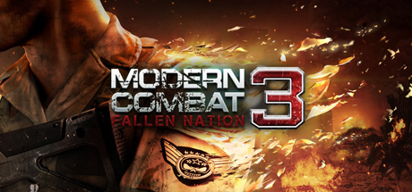

<h1 align="center">
<br>
Modern Combat 3 · PSVita Port
</h1>
<p align="center">
  <a href="#setup-instructions-for-players">How to install</a> •
  <a href="#controls">Controls</a> •
  <a href="#known-issues">Known Issues</a> •
  <a href="#build-instructions-for-developers">How to compile</a> •
  <a href="#credits">Credits</a> •
  <a href="#license">License</a>
</p>

Modern Combat 3: Fallen Nation is a 2011 first-person shooter developed and
published by Gameloft Montreal for a number of mobile platforms. The game is
set in 2028 where North Korea, Russia and Pakistan join forces to invade USA,
thus causing a global war. Modern Combat 3 features an intense 13-mission
campaign with impressive cinematics and memorable moments.

This repository contains a loader of **the Android release of Modern Combat 3 v1.1.7g**,
based on the [Android SO Loader by TheFloW][gtasa]. The loader provides
a tailored, minimalistic Android-like environment to run the official ARMv7
game executable on the PS Vita.

Disclaimer
----------------

**Modern Combat 3: Fallen Nation** is copyright © 2012 Gameloft. All rights
reserved. Gameloft and the Gameloft logo are trademarks of Gameloft in the
U.S. and/or other countries.

The work presented in this repository is not "official" or produced or
sanctioned by the owner(s) of the aforementioned trademark(s) or any other
registered trademark mentioned in this repository.

This software does not contain the original code, executables, or other
non-redistributable parts of the original game product. The authors of
this work do not promote or condone piracy in any way. To launch and play
the game on their PS Vita device, users must possess their own legally obtained
copy of the game in the form of an .apk file.

Setup Instructions (For Players)
----------------

In order to properly install the game, you'll have to follow these steps
precisely:

- (Recommended) Make sure that you are either on 3.60 enso or 3.65 enso firmware
  version. Other versions may work too, but no support are provided for them! If
  you experience any issues apart from described in the
  <a href="#known-issues">Known Issues</a> section, please upgrade or downgrade
  your firmware accordingly before asking for support.

- Install or update [kubridge][kubridge] and [FdFix][fdfix] by copying
  `kubridge.skprx` and `fd_fix.skprx` to your taiHEN plugins folder
  (usually `ur0:tai`) and adding two entries to your `config.txt` under `*KERNEL`:

```
  *KERNEL
  ur0:tai/kubridge.skprx
  ur0:tai/fd_fix.skprx
```

```diff
! ⚠️ Don't install `fd_fix.skprx` if you're using the rePatch plugin!
```

```diff
- ⚠️ Even if you had `kubridge.skprx` installed before, most likely you still
- need to update it, since a new version of the plugin was released at the same
- time as this port. kubridge v0.3.1 or newer is required to run the game!
```

- Make sure you have `libshacccg.suprx` in the `ur0:/data/` folder on your
  console. If you don't, use [ShaRKBR33D][shrkbrd] to get it quickly and easily.

- <u>Legally</u> obtain your copy of Modern Combat 3 for Android in a form
  of an `.apk` file and data files. This port is tailored for v1.1.7g (latest)
  version of the game. Other versions may work too but no support is provided
  for them.

    - If you have it installed on your phone, you can
      [get all the required files directly from it][unpack-on-phone]
      or by using any APK extractor you can find on Google Play.

> ℹ️ Verify that your build is the correct one using **sha1sum** (can also
> be found as an online tool). sha1sum for `lib/armeabi-v7a/libModernCombat3.so`
> **must** be `be0d5e8779899e081a538b3930ec711d2df8aeb4`

- Open the `.apk` with any zip explorer (like [7-Zip](https://www.7-zip.org/))
  and extract the file `lib/armeabi-v7a/libModernCombat3.so` from the `.apk`
  into `ux0:data/mc3/` on your Vita. Example of correct resulting path:
  `ux0:data/mc3/libModernCombat3.so`

- Fetch the game data files from your device. You can find them at
  `/sdcard/Android/obb/com.gameloft.android.ANMP.GloftM3HM`. Copy both files you
  find there (`patch.11428.com.gameloft.android.ANMP.GloftM3HM.obb` and
  `main.1120.com.gameloft.android.ANMP.GloftM3HM.obb`) to `ux0:data/mc3/` on
  your Vita. Example of correct resulting path: `ux0:data/mc3/main.1120.com.gameloft.android.ANMP.GloftM3HM.obb`

- Unpack the video files from the game data. To do that, open your
  `patch.11428.com.gameloft.android.ANMP.GloftM3HM.obb` with any zip explorer
  (like [7-Zip](https://www.7-zip.org/)) and extract all files to
  `/ux0:/data/mc3/data/briefing` on your Vita. Example of correct resulting
  path: `ux0:data/mc3/data/briefing/Briefing_M01.mp4`

- Install `ModernCombat3.vpk` (from [Releases][latest-release]).

- (Optional) Install [CapUnlocker](https://github.com/GrapheneCt/CapUnlocker).
  It may give you a bit better performance.

- (Optional) For trophies to be unlockable, install [NoTrpDRM][notrpdrm].

Controls
-----------------

|       Button        | Action                                                 |
|:-------------------:|:-------------------------------------------------------|
|      ![joysl]       | Move                                                   |
|      ![joysr]       | Control camera                                         |
|      ![trigl]       | Aim                                                    |
|      ![trigr]       | Fire                                                   |
|      ![dpadu]       | Sprint                                                 |
|      ![dpadd]       | Crouch                                                 |
|      ![dpadh]       | Change weapon                                          |
|      ![circl]       | Grenades                                               |
|      ![squar]       | Reload                                                 |
|      ![start]       | Open Menu                                              |

Known Issues
----------------

1. Multiplayer doesn't work, same as on Android, because the servers have been
shut down.
2. ![cross] button works only in main menu. For in-game interaction prompts and
pause menu you will have to use the touchscreen.
3. The highlight effect on interactable objects is constant instead of flashing
like in the original game due to some GXM limitations.
4. In Mission 7, crosshair is not showing when the sniper rifle is zoomed in.
You will have to no-scope it :^)

Build Instructions (For Developers)
----------------

In order to build the loader, you'll need a [vitasdk](https://github.com/vitasdk)
build fully compiled with softfp usage. The easiest way to obtain one is
following the instructions on https://vitasdk.org/ while replacing the URL in
this command:

```bash
git clone https://github.com/vitasdk/vdpm
```

Like this:

```bash
git clone https://github.com/vitasdk-softfp/vdpm
```

All the required libraries should get installed automatically if you follow the
installation process from https://vitasdk.org/.

One thing you'll need to recompile by hand is [VitaGL](https://github.com/Rinnegatamante/vitaGL).
In `source/draw.c` at the start of each `glDraw*` function, add the following line:

```c
if (mode == GL_POINTS) return;
```

And then compile and install using the following flags:

```bash
make SOFTFP_ABI=1 NO_DEBUG=1 NO_DMAC=1 -j$(nproc) install
```

After all these requirements are met, you can compile the loader with the
following commands:

```bash
cmake -S. -Bbuild -DCMAKE_BUILD_TYPE=Debug # Or =Release if you don't want debug logging
cmake --build build -j$(nproc)
```

Also note that this CMakeLists has two "convenience targets". While developing,
I highly recommend using them, like this:

```bash
cmake --build build --target send # Build, upload eboot.bin and run (requires vitacompanion)
cmake --build build --target dump # Fetch latest coredump and parse
```

For more information and build options, read the [CMakeLists](CMakeLists.txt).

Credits
----------------

- [Andy "The FloW" Nguyen][flow] for the original .so loader.
- [Rinnegatamante][rinne] for help with rendering issues, audio/video
  playing issues, video player code, trophy support code.
- [CatoTheYounger][cato] for quality assurance.
- [Once13One][o13o] for LiveArea assets.
- [GrapheneCt][graph] for CapUnlocker.

License
----------------

This software may be modified and distributed under the terms of
the MIT license. See the [LICENSE](LICENSE) file for details.

[cross]: https://raw.githubusercontent.com/v-atamanenko/mc3-vita/master/extras/icons/cross.svg "Cross"
[circl]: https://raw.githubusercontent.com/v-atamanenko/mc3-vita/master/extras/icons/circle.svg "Circle"
[squar]: https://raw.githubusercontent.com/v-atamanenko/mc3-vita/master/extras/icons/square.svg "Square"
[trian]: https://raw.githubusercontent.com/v-atamanenko/mc3-vita/master/extras/icons/triangle.svg "Triangle"
[joysl]: https://raw.githubusercontent.com/v-atamanenko/mc3-vita/master/extras/icons/joystick-left.svg "Left Joystick"
[joysr]: https://raw.githubusercontent.com/v-atamanenko/mc3-vita/master/extras/icons/joystick-right.svg "Left Joystick"
[dpadh]: https://raw.githubusercontent.com/v-atamanenko/mc3-vita/master/extras/icons/dpad-left-right.svg "D-Pad Left/Right"
[dpadv]: https://raw.githubusercontent.com/v-atamanenko/mc3-vita/master/extras/icons/dpad-top-down.svg "D-Pad Up/Down"
[dpadu]: https://raw.githubusercontent.com/v-atamanenko/mc3-vita/master/extras/icons/dpad-up.svg "D-Pad Up"
[dpadd]: https://raw.githubusercontent.com/v-atamanenko/mc3-vita/master/extras/icons/dpad-down.svg "D-Pad Down"
[dpadl]: https://raw.githubusercontent.com/v-atamanenko/mc3-vita/master/extras/icons/dpad-left.svg "D-Pad Left"
[dpadr]: https://raw.githubusercontent.com/v-atamanenko/mc3-vita/master/extras/icons/dpad-right.svg "D-Pad Right"
[selec]: https://raw.githubusercontent.com/v-atamanenko/mc3-vita/master/extras/icons/dpad-select.svg "Select"
[start]: https://raw.githubusercontent.com/v-atamanenko/mc3-vita/master/extras/icons/dpad-start.svg "Start"
[trigl]: https://raw.githubusercontent.com/v-atamanenko/mc3-vita/master/extras/icons/trigger-left.svg "Left Trigger"
[trigr]: https://raw.githubusercontent.com/v-atamanenko/mc3-vita/master/extras/icons/trigger-right.svg "Right Trigger"

[gtasa]: https://github.com/TheOfficialFloW/gtasa_vita
[kubridge]: https://github.com/bythos14/kubridge/releases/
[fdfix]: https://github.com/TheOfficialFloW/FdFix/releases/
[unpack-on-phone]: https://stackoverflow.com/questions/11012976/how-do-i-get-the-apk-of-an-installed-app-without-root-access
[shrkbrd]: https://github.com/Rinnegatamante/ShaRKBR33D/releases/latest
[latest-release]: https://github.com/v-atamanenko/mc3-vita/releases/latest
[issue]: https://github.com/v-atamanenko/mc3-vita/issues/new
[notrpdrm]: https://github.com/Rinnegatamante/NoTrpDrm

[flow]: https://github.com/TheOfficialFloW/
[rinne]: https://github.com/Rinnegatamante/
[graph]: https://github.com/GrapheneCt/
[cato]: https://github.com/CatoTheYounger97/
[o13o]: https://github.com/once13one/
